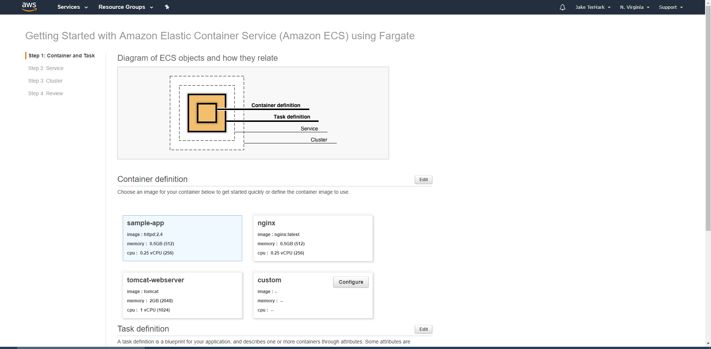
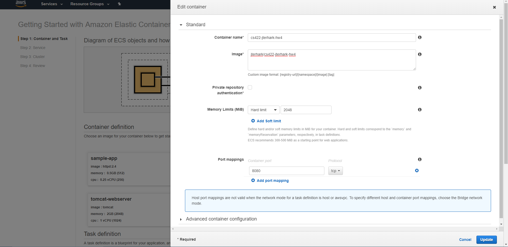
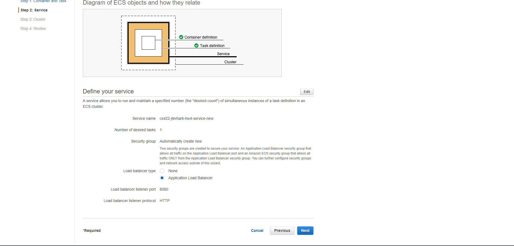
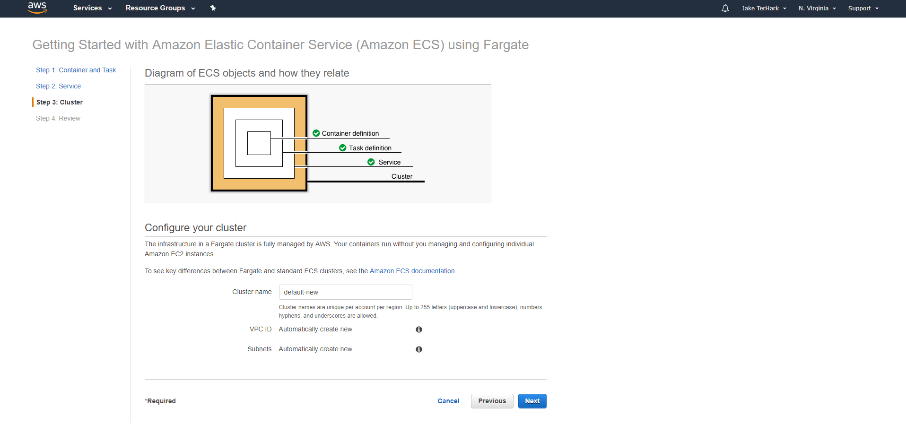
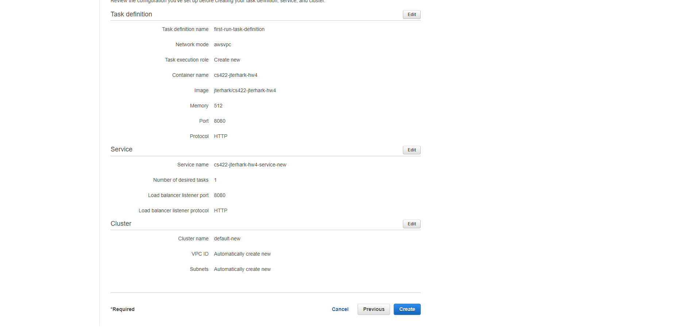
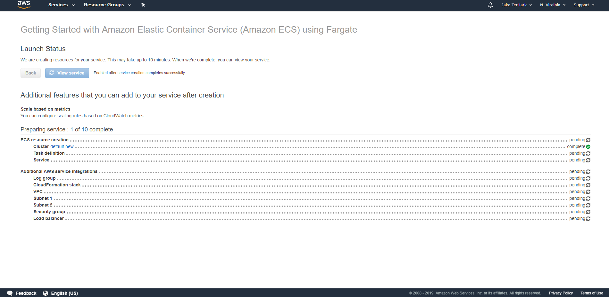
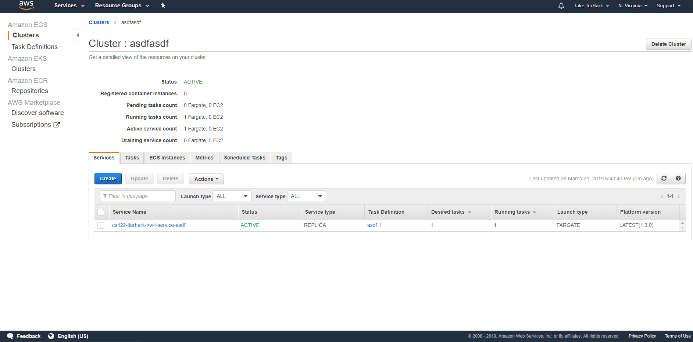
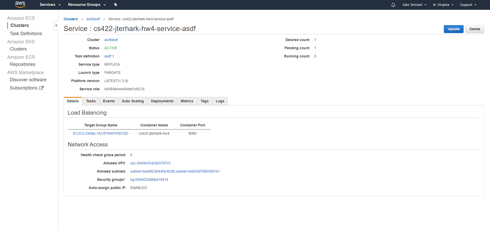
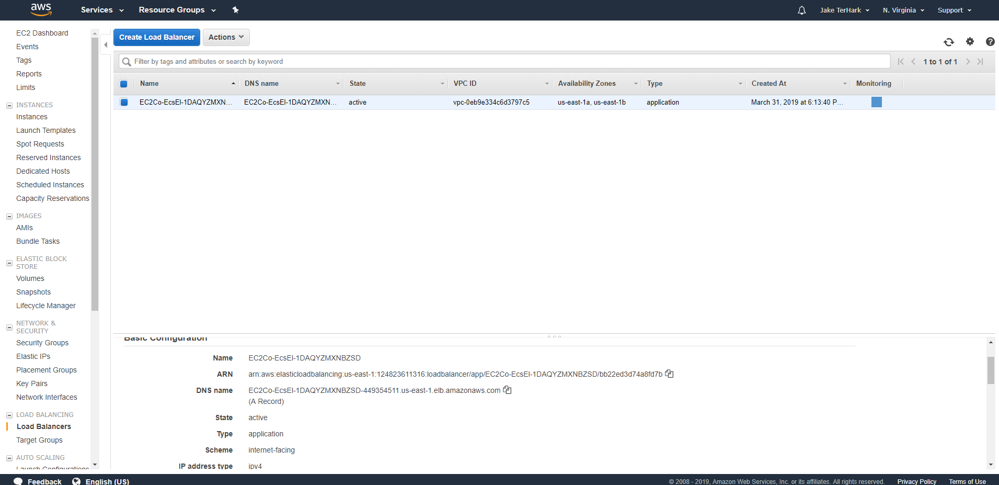
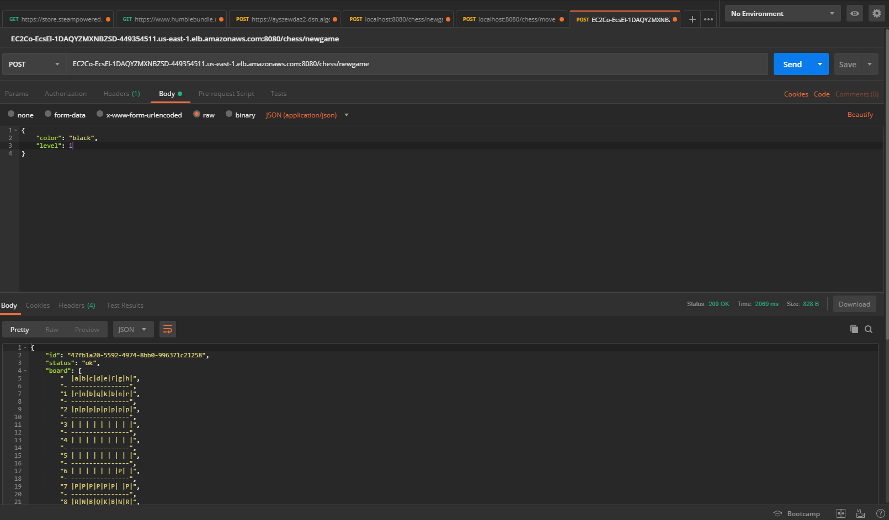

# HW4 - Jake TerHark
## Design
I wanted to make things easy should I have chosen to implement a mysql session store, so my design tries to be as stateless as possible.
Upon a new game request, a unique session id is generated and a new game is built according to the ```newgame``` request parameters.
These parameters and the PGN representation of the board is saved in the Session Store.
When each subsequent request comes in, the game is rebuilt from the PGN string in the session store, thus decoupling the session store from the game.
This also means that the quit game endpoint is not needed. Since there is no connection, any game can be resumed at any time and there is a complete log of all games.

## API Documentation
| route     | purpose | params |  
| --------|---------|-------|
| ```/chess/newgame```  | Create a new game   | color: ```white``` or ```black```, the color you want to be <br>level: ```range(1-3)```, the level of the AI|
| ```/chess/move``` | Human move endpoint | id: Session id<br>from: Source square<br>to: Destination square |
| ```/chess/movePgn``` | Computer move endpoint | id: Session<br>pgn: board in PGN format |
| ```/echo``` | Echo endpoint used for heartbeat | content: ```string``` (Optional) 

### ```/chess/newgame```
#### Sample Request
```json
{
	"color": "white",
	"level": 1
}
```

#### Sample Response
```json
{
    "id": "fcad60c7-a790-4ffe-8094-ebf55cdfe20e",
    "status": "ok",
    "board": [
        "  |a|b|c|d|e|f|g|h|",
        "- ----------------",
        "1 |r|n|b|q|k|b|n|r|",
        "- ----------------",
        "2 |p|p|p|p|p|p|p|p|",
        "- ----------------",
        "3 | | | | | | | | |",
        "- ----------------",
        "4 | | | | | | | | |",
        "- ----------------",
        "5 | | | | | | | | |",
        "- ----------------",
        "6 | | | | | | | | |",
        "- ----------------",
        "7 |P|P|P|P|P|P|P|P|",
        "- ----------------",
        "8 |R|N|B|Q|K|B|N|R|",
        "- ----------------",
        "P - white",
        "p - black",
        "You are white"
    ],
    "boardFen": "rnbqkbnr/pppppppp/8/8/8/8/PPPPPPPP/RNBQKBNR w KQkq - 0 1",
    "boardPGN": "[Event \"Game\"]\n[Date \"2019.3.31\"]\n[White \"Human\"]\n[Black \"Computer\"]\n\n"
}
```


### ```/chess/move```
#### Sample Request
```json
{
	"id": "fcad60c7-a790-4ffe-8094-ebf55cdfe20e",
	"from": "b5",
	"to": "a4"
}
```

#### Sample Response
```json
{
    "status": "ok",
    "board": [
        "  |a|b|c|d|e|f|g|h|",
        "- ----------------",
        "1 |r|n|b|q|k| | |r|",
        "- ----------------",
        "2 | |p|p|p| |p|p|p|",
        "- ----------------",
        "3 | | | | | |n| | |",
        "- ----------------",
        "4 |P| |b| |p| | | |",
        "- ----------------",
        "5 |P| | |P| | | | |",
        "- ----------------",
        "6 | | |P| | | | | |",
        "- ----------------",
        "7 | | | | |P|P|P|P|",
        "- ----------------",
        "8 |R|N|B|Q|K|B|N|R|",
        "- ----------------",
        "P - white",
        "p - black",
        "You are white"
    ],
    "boardFen": "rnbqk2r/1ppp1ppp/5n2/P1b1p3/P2P4/2P5/4PPPP/RNBQKBNR w KQkq - 1 6",
    "boardPGN": "[Event \"Game\"]\n[Date \"2019.3.31\"]\n[White \"Human\"]\n[Black \"Computer\"]\n\n1. a2-a4 e7-e6 2. d2-d4 a7-a5 3. c2-c3 Bf8-c5 4. b2-b4 e6-e5 5. b4xa5 Ng8-f6 "
}
```

#### ```/chess/movePgn```
Not meant to be interacted with directly
#### Sample Request
```json
{
    "id": "fcad60c7-a790-4ffe-8094-ebf55cdfe20e",
    "pgn": "[Event \"Game\"]\n[Date \"2019.3.31\"]\n[White \"Human\"]\n[Black \"Computer\"]\n\n1. a2-a4 e7-e6 2. d2-d4 a7-a5 3. c2-c3 Bf8-c5 4. b2-b4 e6-e5 5. b4xa5 Ng8-f6 "
}
```

#### Sample Resonse
Same as ```/move``` response

#### ```/echo```
#### Sample Request
```hello```

#### Sample Response
```hello```

## Building and Testing
### Locally in Intellij
Import the project into intellij and run ```main``` in ```src/main/API/SpringAPI```.

### Build Uber Jar
If no artifacts are currently configured in Intellij, go to ```File->Project Structure->Artifacts->Add->Jar->From Modules with Dependencies``` .
Select ```SpringAPI``` as the main class.

Once the artifact is setup, execute ```Build->Build Artifacts->Build```.
This will place ```main.jar``` in ```out/artifacts/main_jar```.

### Testing
Tests are located in ```src/test/java/ChessTest.java```. Run any test or all. The ```selfPlay()``` test allows the VAP to play against itself.


## Docker
### Build From Source
In the folder above where the source and ```Dockerfile``` are, run the command ```sudo docker build {folder-name} -t {image-name}```.

### Download from Repo
```sudo docker pull jterhark/cs422-jterhark-hw4```

### Running
To Start<br>
```sudo docker run jterhark/cs422-jterhark-hw4``` or whatever tag you chose when building.<br>
Get IP
```bash
sudo docker container list
sudo docker inspect {container-id} | grep "IPAddress"
```

Once you have the ip address, calls to the service can be made through postman using ```8080``` as the port. Ex ```172.17.0.1:8080\chess\newgame```.


### Deploy to AWS ECS via Fargate
Images can be found in ```/img``` if they do not show up.
If I can afford it, my chess VAP will be up at ```EC2Co-EcsEl-1DAQYZMXNBZSD-449354511.us-east-1.elb.amazonaws.com:8080/chess/newgame``` for testing until April 7, 2019. 

From the fargate creation page, enter your repository information and desired configuration.




Click update and next. Here define the service and make sure application load balancer is checked. If the defaults are not want you want, hit the edit button and change the values.


Click next. Here define the cluster you would like to use. The defaults are OK for this use case.


Once everything has been configured to your liking, click Create


Wait for aws to complete the setup and deployment of your cluster and tasks. When done, click the view service button.


Click on the service name


Click on the target group name


Go to load balancers in the left panel and scroll down to see the DNS name. This is the url that can be used to access the chess VAP.


Requests can then be made using Postman.

## OSv + Capstan
